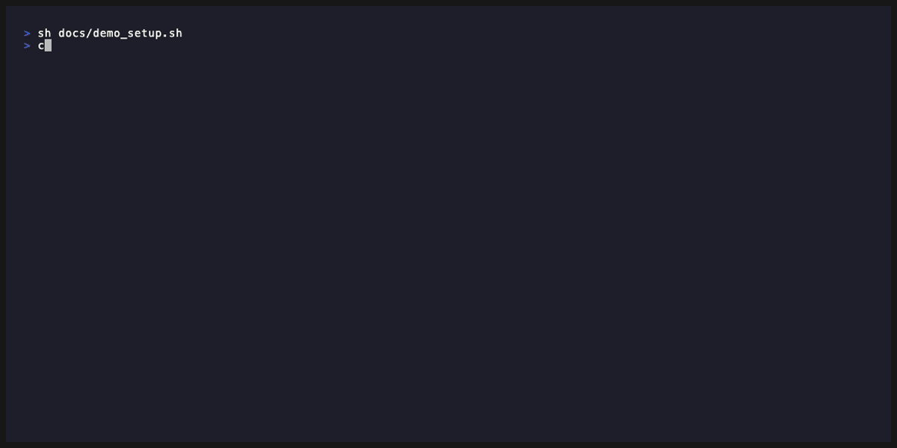
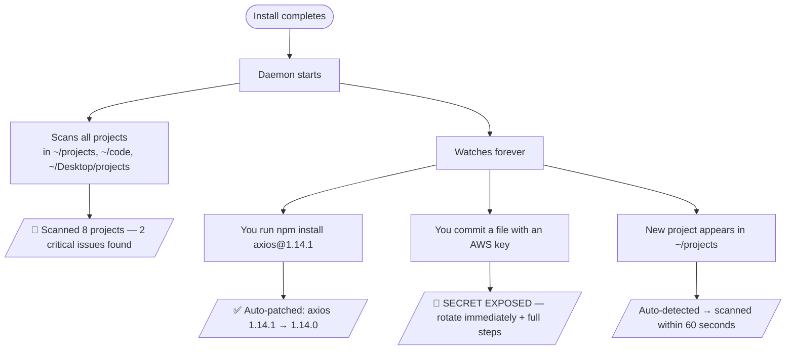

<div align="center">

# 🛡️ Security Autopilot

### Because `npm audit` wasn't enough.

**Catches threats in your code. Fixes them automatically. Never asks you to do anything.**

[](https://github.com/autosecurity-dev/security-autopilot)
[](pyproject.toml)
[](https://pypi.org/project/security-autopilot/)
[](LICENSE)
[](https://modelcontextprotocol.io)

**Works on macOS and Linux** — Windows not currently supported.

⭐ **Star this repo to get notified when new attack signatures are added.**

</div>

---

## The Problem

On **March 30, 2026**, two malicious versions of `axios` — one of the most downloaded npm packages on the planet — were quietly published to npm.

They contained **zero suspicious code inside axios itself**. Any developer who inspected the source would have found nothing wrong.

Instead, they silently injected a fake dependency called `plain-crypto-js` that ran a **postinstall script the moment you ran `npm install`**. That script phoned home to a command-and-control server and dropped a remote access trojan tailored to your OS.

After delivering the payload, it deleted itself and swapped its own `package.json` for a clean decoy. **No trace. No warning. No audit trail.**

`npm audit` reported nothing. GitHub Dependabot reported nothing. Standard code review caught nothing.

> **This is the new shape of supply chain attacks** — and your existing tools aren't built to catch them.

---

## What It Does

Security Autopilot runs silently in the background on your machine from the moment you install it. You never have to open it, ask it anything, or remember it exists.

### 1. Scans all your existing projects on first install

The moment you install it, Security Autopilot walks through your development folders (`~/projects`, `~/code`, `~/Desktop/projects`, etc.), scans every project it finds, and sends you a single desktop notification with a summary. If anything critical is found, it tells you exactly what and where.

### 2. Watches every project forever after

After the initial scan, it keeps watching. The moment you add or update a `package.json`, `requirements.txt`, `go.mod`, `Cargo.toml`, or any lockfile — it scans automatically. No commands to run. No Claude Code required.

### 3. Auto-patches malicious packages

If it detects a known-malicious package (e.g. `axios@1.14.1`), it doesn't just warn you — it fixes it:

- Finds the highest safe version within the same major (semver-compatible, no breaking changes)
- Runs `npm install axios@1.14.0` automatically
- Sends you a desktop notification: **"✅ Auto-patched: axios 1.14.1 → 1.14.0"**

You never even see the bad version in your project.

### 4. Fires a loud alert for exposed secrets

If it finds an API key, token, or password committed to your codebase — it sends an immediate desktop notification with step-by-step rotation instructions specific to that credential type:

> 🚨 **SECRET EXPOSED — Action Required**
> AWS KEY exposed in .env. Go to AWS Console → IAM → Users → Security credentials → Delete key immediately.

Full instructions (all steps) are saved to `~/.security-autopilot/secret-alerts.log` so you can refer back at any time. Covers AWS, GitHub, Stripe, Slack, SendGrid, Twilio, JWT, and more.

### 5. Plugs into Claude Code

When Claude Code is open, Security Autopilot exposes four tools Claude can use directly:

| Tool | What it does |
|---|---|
| `scan_repo(path)` | Full scan — all 4 scanners in parallel, results in plain English |
| `scan_file(filepath)` | Scan a single file |
| `get_findings(severity)` | Retrieve cached findings from previous scans |
| `watch_project(path)` | Start a background watcher on a specific project |

You can just say **"scan this project"** or **"show my security findings"** and Claude handles the rest.

---

## What It Catches

| Threat | How |
|---|---|
| 🔴 **Known-malicious packages** | Blocklist of confirmed-bad versions updated as attacks happen |
| 🟠 **Maintainer account hijacks** | Detects publisher email changes between versions |
| 🟠 **Postinstall script injection** | Flags `preinstall`, `postinstall`, `prepare` lifecycle hooks |
| 🟠 **Exposed secrets** | API keys, tokens, passwords committed to any file |
| 🟡 **CVEs in dependencies** | Trivy scans against the full NVD vulnerability database |
| 🟡 **Code-level bugs** | Semgrep: SQL injection, XSS, `eval(userInput)`, 1000+ patterns |
| 🟡 **Recently published versions** | 72-hour cooldown gate on brand-new releases |
| 🟡 **Floating version pins** | `^` and `~` pins that allow silent upgrades |
| 🔵 **Missing SLSA provenance** | Packages published without cryptographic build attestations |
| 🔴 **C2 indicators in installed files** | Embedded command-and-control strings inside `node_modules` |
| 🔴 **Post-compromise RAT artifacts** | Known filesystem/process artifacts left by the Sapphire Sleet RAT |
| 🔴 **Transitive dependency exposure** | Packages you didn't install directly that pulled in a compromised version |
| 🟠 **Auto-upgrade vectors** | `^`/`~` pins on axios that would silently resolve to a malicious release |
| 🟠 **Missing lockfile** | `package.json` without a lockfile — allows runtime version resolution |
| 🔵 **CI/CD pipeline exposure** | Pipelines using `npm install` instead of `npm ci` during the attack window |

---

## Install

**Recommended — verified install via PyPI:**

```bash
uvx security-autopilot
```

This pulls a cryptographically signed build from PyPI (OIDC trusted publishing — the binary is provably built from this repo's GitHub Actions). No domain to hijack, no unsigned script.

**Alternative — one-liner for convenience:**

```bash
curl -fsSL https://raw.githubusercontent.com/autosecurity-dev/security-autopilot/main/install.sh | sh
```


> *Demo: scanning a project with axios@1.14.1 — detected and auto-patched in seconds. ([record your own](docs/RECORDING.md))*

Either install method:
1. Installs `uv` (Python package manager) if not present
2. Installs `security-autopilot` from PyPI
3. Installs `trivy`, `gitleaks`, and `semgrep` scanner CLIs
4. Patches `~/.claude/claude.json` to register the Claude Code plugin
5. Registers a background daemon that starts automatically at every login
6. Immediately scans all your existing projects

Safe to run twice — fully idempotent.

> **Telemetry:** Telemetry is off by default. To opt in, set `~/.security-autopilot/telemetry_consent` to `opted_in`. Only sends OS + Python version on startup.

---

## What Happens After Install



---

## Scanners

| Scanner | What it catches | Requires |
|---|---|---|
| **Supply Chain** | Known-bad versions, account hijacks, lifecycle scripts, floating pins | Built-in |
| **Trivy** | CVEs in npm, pip, Go, Rust, Java dependencies | Auto-installed |
| **Gitleaks** | Hardcoded secrets, API keys, tokens, passwords | Auto-installed |
| **Semgrep** | 1000+ SAST rules: injection, XSS, insecure patterns | Auto-installed |

Security Autopilot works with reduced coverage if a scanner is missing — it never crashes.

---

## For Contributors

```bash
uv run pytest tests/ -v                          # run all tests (23 total)
python -m mcp_server.server --version            # print version and exit
python -m mcp_server.server                      # start MCP server manually
security-autopilot daemon start|stop|status      # control the background daemon
```

See `CLAUDE.md` for the complete project context, coding rules, and how to add a new scanner.

### Known-Bad Versions

```python
# mcp_server/tools/supply_chain.py → KNOWN_BAD
[
  {"name": "axios",           "version": "1.14.1", "reason": "Sapphire Sleet supply chain attack March 31 2026 — deploys cross-platform RAT",     "cve": "N/A", "source": "Microsoft Threat Intelligence"},
  {"name": "axios",           "version": "0.30.4", "reason": "Sapphire Sleet supply chain attack March 31 2026 — deploys cross-platform RAT",     "cve": "N/A", "source": "Microsoft Threat Intelligence"},
  {"name": "plain-crypto-js", "version": "4.2.1",  "reason": "Purpose-built RAT dropper used in axios supply chain attack",                       "cve": "N/A", "source": "Microsoft Threat Intelligence"},
  {"name": "plain-crypto-js", "version": "4.2.0",  "reason": "Seeded decoy package from same Sapphire Sleet campaign (publishing history cover)", "cve": "N/A", "source": "Microsoft Threat Intelligence"},
]
```

PRs to extend this list are welcome.

---

## License

MIT — free to use, modify, and distribute.

---

<div align="center">

Built in response to the **March 2026 axios supply chain attack**.

⭐ [Star this repo](https://github.com/autosecurity-dev/security-autopilot) to get notified when new attack signatures are added.

</div>
